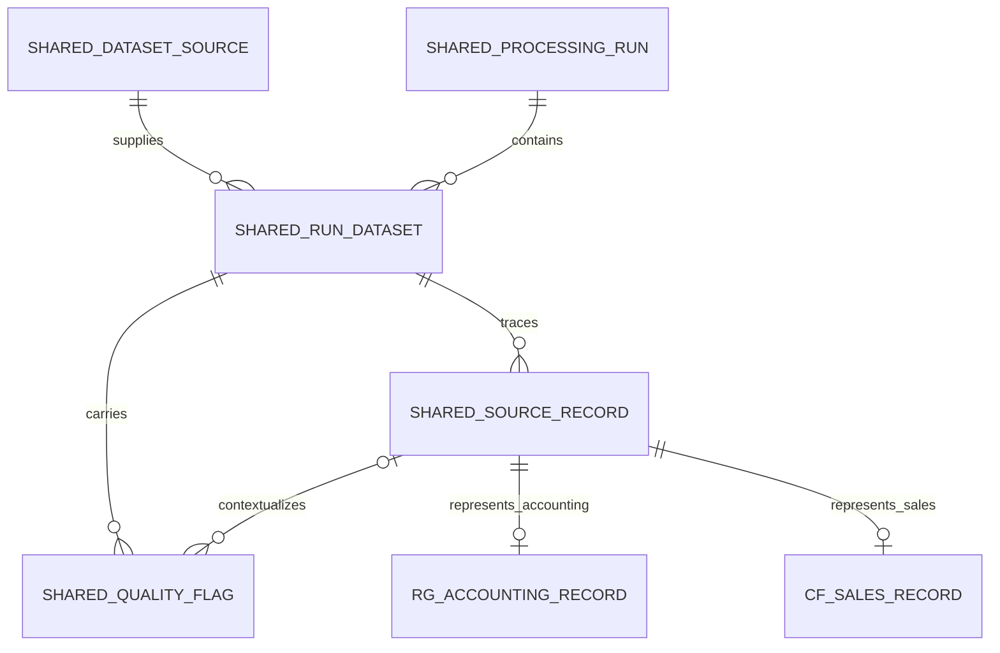

# Financial Manager AI — Semantic Data Model

Phase 3, checkpoint 06. Scope: the approved cleaning run
`20260928T190320706702Z_0a18cf5b`, as authorized by the user. This authorization
supersedes earlier planning-only restrictions for this data layer. The older
BRL/single-company proposals are not facts about either imported dataset.

## Evidence and principles

Evidence: [inventory](../notebooks/01_dataset_inventory.ipynb),
[Receiver General EDA](../notebooks/02_eda_receiver_general.ipynb),
[sales EDA](../notebooks/03_eda_company_financials.ipynb),
[cleaning plan](../notebooks/04_cleaning_plan.ipynb),
[cleaning execution](../notebooks/05_data_cleaning.ipynb), and the approved run's
manifest, validation report and review flags. The implementation pins that run's
files by SHA-256, including its manifest. No new EDA or cleaning is part of this model.

- Source-specific meaning remains local to its domain. Shared infrastructure
  establishes provenance, not comparable money, business identity or event grain.
- Preserve all processed values, raw companions, statuses and every source row.
- Technical keys identify stored representations; candidate keys do not establish
  stable business identity. Source row positions are lineage, not business keys.
- Preserve uncertainty rather than infer currency, fiscal alignment or record type.
- Monetary magnitude and knowledge of its currency are distinct. UNKNOWN remains
  unknown. Quantity is not money merely because its original token contains `$`.
- Derived analytical features and model outputs are not base financial facts.
- No accounting/sales business join, generic transaction fact, inferred company,
  or common fiscal calendar is supported by the current evidence.

## Concepts and cardinalities

| Concept / domain | Purpose, fields and source | Relationships / cardinality | Uncertainty |
|---|---|---|---|
| Dataset source / shared | Source label and domain meaning from inventory; publisher and redistribution attribution remain in documentation | One source has many run-specific extracts | Exact acquisition chain incomplete |
| Processing run / shared | Approved cleaning run ID, rule version via original manifest, original manifest/report text and hashes; ingestion timestamp | One run has two current dataset extracts; more runs require explicit approval | Cleaning validity is representation validity, not complete business validity |
| Run dataset / shared | Raw path/hash, processed path/hash, expected rows and type/header contract from manifest | Belongs to one run and one dataset; has many source records | Local hash identifies bytes, not authoritative origin |
| Source record lineage / shared | Technical record key, cleaning run, source, one-based original CSV data-record position, processed row position | Exactly one current domain row per lineage; many optional flags | Position excludes header and is not an event identifier |
| Data quality flag / shared | Original scope, field, rule ID, flag, status, token and reason from review CSV; original flag row position | Dataset scope targets a run dataset; field/record scope additionally targets one lineage | A flag is not proof of fraud or error; absence of flag is not business certification |
| Receiver General accounting record / accounting | All 16 source fields plus raw/status companions and currency metadata | One-to-one with its lineage; no sales-record relationship | Voucher/detail and summary/control representations may overlap; no row-type classifier inferred |
| Company Financials sales record / sales | All 16 source fields plus raw/status companions and currency metadata | One-to-one with its lineage; no company relation | Exact aggregation grain and stable business identity not established |
| Currency metadata / embedded in each domain | Original currency, code, source/evidence and status from processed rows | Applies only to manifest-declared monetary fields of that row | All codes/evidence null and status UNKNOWN; Units Sold excluded |
| Financial period / source-local attributes | Effective date and independent fiscal labels for accounting; supplied period date/month/year/name for sales | Attributes of each domain row, not a shared calendar relation | Accounting fiscal alignment unresolved; sales day-one dates are period labels, not proven sale dates |
| Organizational/account dimensions / accounting attributes | Department, ledger, subledger, coding block, control/voucher fields exactly as supplied | Repeated labels on accounting records; no master entity tables | Undocumented identities and sparse coverage preclude invented hierarchies |
| Sales dimensions / sales attributes | Segment, Country, Product, Discount Band | Repeated categories on sales records | Country/product/segment combinations are not company identities |
| Monetary observations / embedded source measures | Accounting amount; sales prices, Gross Sales, Discounts, Sales, COGS, Profit | Each measure belongs to one source record, carries its own raw token/status | Unknown denomination and comparability; Sales is not renamed company revenue |

Accounting's summary line count describes grouped underlying detail according to
the reviewed dictionary. It is not an imported-row multiplicity or a license to
expand rows. DR/CR remain source codes, not expense/revenue or cash directions.
Candidate `(accounting_control_number, journal_voucher_item_identifier)` is unique
in this extract. The sales candidate is `(segment, country, product, discount_band,
period_date, sale_price)`; omitting price leaves 12 repeated combinations. Neither
candidate becomes a universal key or justifies deduplication.

## Shared infrastructure and separate domains

Every current lineage has exactly one appropriate domain record; the optional
branches express mutually exclusive source domains. Ingestion validation enforces
total coverage. Composite foreign keys and domain checks prevent a sales record
from using accounting lineage. There is deliberately no canonical financial-fact
layer: common storage does not establish common recognition, currency or grain.

## Lineage and review conditions

A domain record resolves through lineage and run dataset to the raw path/hash,
cleaning run, original data-row position, processed path/hash and processed row.
Every original field remains recoverable from its raw companion; immutable raw
bytes preserve CSV quoting/BOM/line endings. The manifest preserves original
header mappings and rules. The database does not rewrite either representation.

Keep actual flag names unchanged: `source_missing`, `unresolved_placeholder`,
`currency_unknown`, `source_semantics_unresolved`, `fiscal_alignment_unresolved`.
The existing semantic flag's `field=provenance` identifies provenance uncertainty;
it is not silently renamed. Zero present parser failures or key conflicts are
reported as validation results. Future `parsing_failed`, `key_conflict`, separate
semantic/provenance flags and record-level review are representable, but are not
invented for this import. Scope is dataset, field, or record check; dataset flags
must not be multiplied across all rows.

## Currency and extension points

Preserve original amount, original token, original currency/code, currency status,
currency evidence and source date. A future currency interpretation needs its
evidence and version; it must not overwrite unknown source evidence. A future FX
result would separately identify original record/measure, original and base
currency, rate, rate date/source, conversion convention, converted value and run.
No FX tables, rates, default currency or conversions are created now.

Future Accounts Payable needs verified suppliers, obligations, invoices, due dates
and settlements; Budget Variance needs versioned plans and comparable actuals;
Cash Flow needs verified cash accounts, movements and balances. Documents need
their own document/version/evidence lineage; forecasts and anomaly results need
method/run/target-record links and must remain distinct from source facts.
These may reuse source/run/quality infrastructure and add domain tables only
after their sources and identities are established. No empty speculative domain
tables or relationships to the current facts are implemented.

## Checkpoint 06

PASS: separate domains; no business join or fake company; fiscal uncertainty
unchanged; currency UNKNOWN; complete lineage design; future domains can be added
without redefining current records. Unresolved semantics limit interpretation but
do not block faithful storage. Continue to [schema design](database_schema.md).
