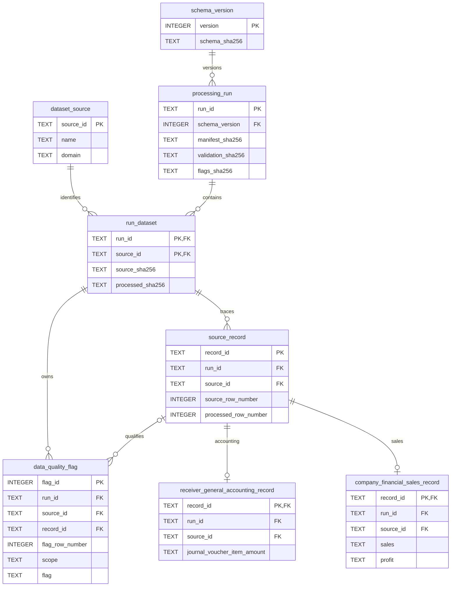

# Financial Manager AI — SQLite Schema

Phase 3 checkpoint 07; schema version 1. Implements [semantic model](data_model.md).
Authoritative DDL: [schema.sql](../src/database/schema.sql). SQLite STRICT tables
require SQLite 3.37+; the existing runtime supplies a compatible version.
Python standard-library sqlite3 is sufficient; no dependency is added.

## Tables, keys and relationships

| Table | Primary key | Role and constraints |
|---|---|---|
| schema_version | version INTEGER | Version 1 plus DDL hash; validates reproducible schema |
| dataset_source | source_id TEXT | Source-scoped labels: receiver_general/accounting and company_financials/sales |
| processing_run | run_id TEXT | Approved cleaning run, ingestion time, schema FK, original manifest/report JSON and their hashes, flags hash, approval pins |
| run_dataset | (run_id, source_id) | FKs to run and source; original/processed paths and hashes, row baseline, full output schema |
| source_record | record_id TEXT | Stable technical SHA-256 of a JSON tuple (cleaning run, source ID, source row); unique source and processed positions within run/source |
| receiver_general_accounting_record | record_id TEXT | Composite FK (record_id, run_id, source_id) to lineage; CHECK source_id=receiver_general |
| company_financial_sales_record | record_id TEXT | Same lineage pattern, CHECK source_id=company_financials; no company ID |
| data_quality_flag | flag_id INTEGER | Original flag position unique within run; run/source FK and optional composite record FK; preserves original flag fields |

Technical record IDs are reproducible for the identical run/source/row tuple.
They are not business identity and intentionally change for another cleaning run.
Database flag IDs are insertion-order surrogate IDs; flag_row_number preserves the
original review-report ordering. Candidate keys are validated for this approved
extract, not imposed as universal UNIQUE constraints: repeated future business
keys must be reviewed rather than silently dropped. Reimporting this run into a
new database is reproducible; initialization refuses an existing destination.

All foreign keys restrict orphaning by default; no cascade deletion. The two
domain tables have no foreign keys to each other. Composite lineage FKs, fixed
domain source checks and post-load completeness checks enforce source ownership.
A dataset flag has no record_id and an empty original source_row_number; a
field/record flag has a resolvable record. Original flag vocabulary is preserved
without treating a semantic flag as a detected accounting error.

## Physical diagram



## Source-field storage

Each of the 16 source fields in each domain has its unchanged standardized value,
a non-null TEXT `_raw` companion and a non-null TEXT `_status` companion.
The manifest's source path/hash/row columns resolve through lineage and
run_dataset; their exact values are reconstituted in validation. The four currency
columns remain on the domain row. No processed field is lost.

| Domain | Standardized field | SQLite type | Manifest semantic type |
|---|---|---|---|
| receiver_general | `accounting_control_number` | TEXT | string |
| receiver_general | `journal_voucher_type_code` | TEXT | string |
| receiver_general | `fiscal_year` | TEXT | string |
| receiver_general | `journal_voucher_identifier` | TEXT | string |
| receiver_general | `accounting_effective_date` | TEXT | date |
| receiver_general | `department_number` | TEXT | string |
| receiver_general | `fiscal_month` | INTEGER | integer |
| receiver_general | `journal_voucher_item_identifier` | TEXT | string |
| receiver_general | `financial_coding_block` | TEXT | string |
| receiver_general | `subledger_account_identifier` | TEXT | string |
| receiver_general | `credit_debit_code` | TEXT | string |
| receiver_general | `journal_voucher_item_amount` | TEXT | decimal |
| receiver_general | `control_data_type` | TEXT | string |
| receiver_general | `accounting_summary_transaction_line_count` | INTEGER | integer |
| receiver_general | `gbs_control_number` | TEXT | string |
| receiver_general | `general_ledger_account_code` | TEXT | string |
| company_financials | `segment` | TEXT | string |
| company_financials | `country` | TEXT | string |
| company_financials | `product` | TEXT | string |
| company_financials | `discount_band` | TEXT | string |
| company_financials | `units_sold` | TEXT | decimal |
| company_financials | `manufacturing_price` | TEXT | decimal |
| company_financials | `sale_price` | TEXT | decimal |
| company_financials | `gross_sales` | TEXT | decimal |
| company_financials | `discounts` | TEXT | decimal |
| company_financials | `sales` | TEXT | decimal |
| company_financials | `cogs` | TEXT | decimal |
| company_financials | `profit` | TEXT | decimal |
| company_financials | `period_date` | TEXT | date |
| company_financials | `month_number` | INTEGER | integer |
| company_financials | `month_name` | TEXT | string |
| company_financials | `year` | INTEGER | integer |

Dates are ISO YYYY-MM-DD TEXT with SQL shape checks and Python calendar/date
round-trip validation. Fiscal Year remains a string and is never derived from
effective date. Fiscal Month and Month Number have 1–12 checks; optional summary
counts are nonnegative INTEGER. Sparse fields remain nullable. Nullable status
checks require absent values for source_missing/unresolved_placeholder/parsing_failed
and present values for kept/parsed/standardized. An empty raw token stays empty TEXT.
Literal None stays TEXT. No missing values become zero or not-applicable.

Currency status supports UNKNOWN/INFERRED/CONFIRMED as a knowledge vocabulary;
only UNKNOWN is accepted from this approved import. UNKNOWN has no assigned
currency/evidence. Future known codes must be three uppercase characters with
evidence, but code validity/denomination requires a separately approved source.
Currency metadata excludes Units Sold. No converted-amount/rate/base-currency
columns or tables exist.

## Exact decimal policy

Preserve the processed fixed-point decimal text verbatim in TEXT columns, including
sign and supplied scale. SQL lexical checks reject malformed decimal shapes;
the loader validates canonical fixed-point text and compares every reloaded token
against the hash-pinned processed source. Python Decimal validation never routes
through float. Source negative Profit and every extreme remain exact.

Alternatives considered: REAL/NUMERIC affinity risks binary conversion;
scaled INTEGER can be exact but requires a scale and overflow contract, and would
discard lexical precision unless additional metadata were retained. Decimal TEXT
fits the current interchange contract without currency-minor-unit assumptions.

SQLite SUM, AVG, arithmetic operators and CAST on these TEXT amounts are not
approved exact arithmetic: SQLite may coerce to binary floating point, and text
ordering is not numeric ordering. Validation connections register DECIMAL_SUM,
which accumulates Decimal under precision 60 with Inexact/Rounded traps and returns
fixed-point text. NULL operands are skipped with counts reported separately;
all-null groups yield NULL. Smoke totals are preservation checks in unknown source
units, not economic totals, currency-comparable aggregates or signed net cash.

## Indexes

| Index | Query purpose |
|---|---|
| rg_effective_date | Effective-date ranges |
| rg_department_voucher | Department filtering with optional voucher type |
| rg_direction | DR/CR grouping/filtering |
| rg_ledger (non-null only) | Sparse ledger lookups |
| sales_period | Period filtering and grouping |
| sales_categories | Country, then segment/product/discount-band filtering |
| quality_record (non-null only) | Flag lookup for one source record |
| quality_condition | Run/source/flag review |

PK/UNIQUE constraints supply metadata/lineage indexes. No index per column or
speculative materialized aggregate is added. Voucher-only and product-only queries
can scan these small tables; query evidence can justify later indexes.

## Initialization and verification interface

From the project root, with the existing environment:

```sh
.venv/bin/python -m src.database.initialize
.venv/bin/python -m unittest discover -s tests -v
```

Default output: `data/database/financial_manager.db`. Pass `--database PATH`
for a new rebuild destination; existing files are refused. Only run
`20260928T190320706702Z_0a18cf5b` is eligible. The checked-in approval file pins all
five artifact hashes (including manifest/report), raw hashes and notebooks 01–05.
Directory recency never selects the run.

The module verifies approval/manifest/report, reads typed processed rows, creates
schema and loads metadata, lineage, source records and flags inside one explicit
transaction on a new temporary database. Failed gates rollback; successful
in-transaction validation is followed by commit, close and a read-only reopen.
A destination is published only after disk verification and protected-hash checks.
Publication refuses replacement. No raw or processed writes occur.

Post-load checks compare every field/token/status and exact decimal, lineage,
row counts, candidates, repeated keys, nulls, dates, currency and flags with the
approved artifacts; counts come from artifacts rather than hard-coded flag totals.
Expected current baseline rows are 9,282/700. Smoke queries cover counts, accounting
amount by DR/CR, voucher counts, date range, sales sum, period Profit and sales
categories. Expected integrity result: `ok`; foreign-key check: no rows.
Schema metadata and reproducibility are verified by rebuilding in tests.

## Checkpoint 07

PASS: each present concept has a table or embedded attributes; master companies,
account/department hierarchies, canonical facts, FX and future modules are explicitly
deferred. Exact decimals, null reasons, source ownership and currency uncertainty
remain preserved. Implementation may proceed within this schema.

## Remaining limits

Preservation cannot resolve fiscal alignment, summary/item overlap, local extract
provenance, exact sales-record grain, dollar-dash meaning, or currency denomination.
Review flags preserve those limits. No query validation establishes cash-flow,
budget, balance-sheet, company-panel or operational financial-tool semantics.
