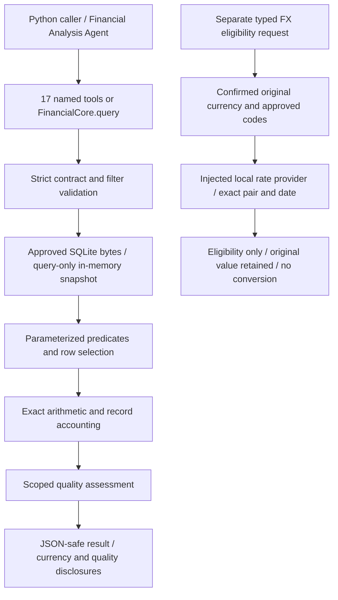

# Financial Core — Phases 4.10–4.12

The offline Financial Core implements all 17 version-1.0
[query contracts](query_contracts.md). It uses the existing Phase 3 database
without modifying its schema, metadata or records. This implementation was
explicitly authorized after Step 09; earlier planning-only restrictions remain
historical context rather than authorization for further modules.

The contracts remain authoritative for filters, statistics, statuses, groupings,
record accounting and response shape. No contract redesign or schema
incompatibility was needed. This document describes implementation and operation,
not another copy of the contract catalog.

## Architecture and use



All implementation uses the Python standard library. No dependencies, keys,
network client, LLM, backend or frontend are required. SQLite deserialization is
provided by the existing Python runtime. Execute from the project root:

```python
import json
from src.financial import FinancialCore
from src.financial.receiver_general import receiver_general_amount_by_department

core = FinancialCore()
response = receiver_general_amount_by_department(
    core, period={"year": 2023, "month": 5}, missing_dimension="bucket"
)
print(json.dumps(response, ensure_ascii=False, allow_nan=False))
```

Named functions take the core as their first argument and only the contract's
optional/required analytical parameters as keyword arguments. They fix name,
dataset and version. Alternatively, use the complete request interface:

```python
response = core.query({
    "contract_version": "1.0",
    "query_name": "company_financials_discount_analysis",
    "dataset": "company_financials",
    "filters": {"discount_band": {"eq": "None"}},
})
```

This returns NO_DATA for numeric Discounts with 53 candidates and unresolved
placeholders, not an invented zero. Count queries remain separate from numeric
availability. The Python examples can be used from a terminal; this phase adds
no natural-language parser or agent-facing execution framework.

`FinancialCore(project_root=...)` is trusted application configuration. A query
cannot set a root, database path, run ID, SQL, table, join, expression or currency.
Expected caller mistakes use the approved structured error envelope; unexpected
programming/provider failures raise and are not mislabeled as NO_DATA.

| Module | Responsibility |
|---|---|
| `src/financial/core.py` | Normalize → read → calculate → assess → assemble result |
| `contracts.py` | Closed 17-contract registry and public-to-physical field mapping |
| `receiver_general.py`, `company_financials.py` | Stable named entry points |
| `models.py` | Common envelope, arithmetic metadata and typed contract failures |
| `filters.py` | Strict normalization, supported-operation checks, bound SQL predicates |
| `snapshot.py` | Approved-run/hash verification and query-only SQLite access |
| `arithmetic.py` | Exact Decimal statistics and one-rounding rational calculations |
| `quality.py` | Selection accounting, coverage, evidence relevance and status effects |
| `currency.py` | Currency evidence, original monetary value and query disclosures |
| `fx.py` | Exact dated rate model, provider protocol, local repository and eligibility |

## Read-only snapshot and reproducibility

Contract 1.0 pins cleaning run `20260928T190320706702Z_0a18cf5b`, schema version 1
and the exact database artifact documented in Step 09. Each query checks the
database and DDL hashes, plus the approved artifact/input hashes. The first query
on a core instance also runs all 57 existing database validation checks. That
validation can be reused because subsequent requests verify identical bytes.

The bytes whose hash was verified are deserialized into a disposable SQLite
connection with `PRAGMA query_only=ON` and foreign keys enabled. The disk
database is never opened for writing. Queries use this consistent verified
copy, avoiding a path-reopen race; connections close after reading. No cached
mutable result or connection is exposed to callers.

The query engine uses SELECT statements with bound values. Trusted mappings
choose physical identifiers. Filter predicates are projected for each source
row so the same pass can distinguish true, false and unavailable membership and
produce population-wide diagnostics. AND evaluation gives known false priority
over unknown. Row selection and reductions then operate in source-row order.
This is appropriate for the current 9,282/700-row extracts; it is not a streaming
or large-database optimization layer.

Flags are fetched independently from domain rows. A one-to-many flag join cannot
multiply financial amounts. Source positions and hash metadata provide lineage;
they never become business identities. All output groups and ties have the
ordering specified in Step 09. No current-time value enters query results.

A changed database, source/processed artifact, notebook pin, schema or validation
invariant yields DATA_QUALITY_BLOCKER. An intentional future rebuild with a
different database hash needs explicit snapshot approval; initialization is not
run by the Financial Core. Hash verification is consistency protection against
the approved local artifacts, not a claim to resolve external source provenance.

## Arithmetic, missingness and quality

Stored decimal TEXT goes directly to Decimal. SUM follows precision 60 with
Inexact/Rounded traps, including a single-operand precision check. MIN/MAX and
rankings compare numeric values and preserve the winning source token. Even
medians preserve additional exact fractional digits. Means and coverage
percentages round an exact integer rational once to six places using half-even;
they do not depend on process-global Decimal precision. No financial float cast,
SQLite numeric coercion, currency quantization or monetary-share calculation is
present. Exact-operation overflow fails the whole result without a subtotal.

Record accounting is independent of arithmetic: filter-out, filter-unavailable,
candidate, used and excluded populations reconcile. Multi-measure participation
uses a union for overall counts and independent coverage for each measure.
Dimension exclusion takes precedence over measure absence. Available zero and
negative amounts are retained; missing measures remain null. Source placeholders
are never recomputed from financial identities.

The reusable quality interface is `quality.assess(...)`, returning the disclosure
and whether relevant coverage is partial. Its inputs are normalized request
context, scoped evidence, selected records and calculated coverage—not an LLM
assessment. `coverage`, `dimension_coverage`, `select_rows`, `observed_period`
and `result_status` concentrate the related accounting/status rules.
Hard blockers use the shared `ContractError` model and are raised by snapshot
validation or exact arithmetic before a successful envelope is assembled.

Warnings use original flag names and source reasons. The active source vocabulary
is `source_missing`, `unresolved_placeholder`, `currency_unknown`,
`fiscal_alignment_unresolved`, and `source_semantics_unresolved`. In particular,
provenance is the latter flag with field `provenance`; it is not renamed.
No parsing-failure or key-conflict warning is manufactured when none exists.

The distinctions are:

- Informational uncertainty: UNKNOWN currency, provenance and grain flags can
  accompany SUCCESS. They never alter numeric values.
- Partial coverage: relevant missing group values, unavailable filter membership,
  missing requested measures, returned extreme-record context, or interval bounds
  beyond extract coverage produce PARTIAL if some analytical result remains.
- No usable result: no matches, no group-eligible rows or no numeric values use
  the distinct NO_DATA reasons. Existing all-null groups remain visible.
- Blockers: altered snapshots, failed representation/lineage invariants and exact
  arithmetic limits return errors instead of warnings or fabricated subtotals.

Explicit null-only/null-exclusion predicates have known membership. Counting
deliberately selected null-dimension records can therefore succeed, with an
informational missing-field warning. An unselected sparse department never makes
an unrelated amount summary partial. Extreme-record context warnings depend on
returned items, while flags for other candidates remain available.

Step 09 explicitly requires the fiscal-alignment disclosure for RG calendar
period filtering/grouping as well as fiscal filters. This implementation keeps
that approved scope; a calendar query does not map fiscal months or reinterpret
fiscal labels. For example, May 2023 includes three records with fiscal year
`2022/2023`, preserved as supplied.

`quality_detail="summary"` includes all original flag references grouped by the
approved evidence fields; `"full"` retains raw tokens, lineage, reason and
per-record relevance. Neither mode changes financial results. Dataset-level
flags count once. Query relevance and missing counts are calculated from the
selected rows, not copied from historical full-extract totals.

## Currency and FX

`CurrencyMetadata` distinguishes UNKNOWN, INFERRED and CONFIRMED. UNKNOWN has no
code/evidence; the other states require a code and evidence source. Construction
does not verify that an evidence string is authoritative: trusted ingestion or
review must establish that fact before supplying CONFIRMED. No tool infers a
state from symbols, countries, source labels or provisional project defaults.

MIXED remains the future envelope-level concept described in Step 09. It is not
a valid currency for a scalar `MonetaryValue`, a stored source-row state or an
emitted query state. Supporting it later requires separate amount/currency/
evidence partitions, never one mixed monetary total.

`MonetaryValue` is immutable and retains a finite Decimal and its original
currency metadata. It does not impose currency minor-unit rounding. Units Sold
is not wrapped in this model. Current monetary query envelopes always carry
UNKNOWN with `code=null`, `source=null`, and `conversion_applied=false`; counts
and quantities carry `currency=null`.

`FXRate` is an immutable quote: target-currency units per one source-currency
unit. It preserves both codes, exact positive Decimal rate, exact rate date,
source, provenance, optional timezone-aware import timestamp and optional rate
type. It never supplies an invented rate. Duplicate pair/date quotes are rejected
by the local repository; a caller must select one approved rate source/type
before constructing that repository.

`FXRateProvider.get_rate(FXRateRequest)` is the complete provider interface.
Every request contains only `from_currency`, `to_currency`, and `rate_date`.
Historical lookups use this same exact-date method. There is no implicit latest
rate, nearest date, inversion, triangulation, weekend fallback or network fallback.

`LocalFXRateProvider()` starts empty and performs no I/O. Application code may
explicitly supply validated, approved FXRate objects from a future local database,
CSV import or reviewed dataset. No rate files, database tables or production
rates are created in this phase. Numerical rate fixtures exist only in tests.

`assess_fx_eligibility` is a separate internal typed interface, not an eighteenth
analytical query contract:

1. Require a confirmed original currency. UNKNOWN and INFERRED return
   SOURCE_CURRENCY_UNCONFIRMED without calling the provider.
2. Validate the target, distinct currency pair and exact date. Code shape alone
   does not establish a valid currency; both codes must belong to an explicitly
   supplied offline `frozenset` of approved codes. Invalid input returns
   INVALID_REQUEST. No online ISO-code lookup is needed or performed.
3. Ask the injected provider for that public pair/date only. A missing rate
   returns RATE_UNAVAILABLE. A mismatched provider response is a programming/
   integration failure and raises rather than substituting a rate.
4. An exact rate returns RATE_AVAILABLE. This is eligibility for a **future**
   approved conversion, not a calculated or authorized conversion.

Every eligibility response preserves the original object and serializes the
original amount/currency, target, requested date and available rate evidence.
`converted_amount` is always null and `conversion_applied` always false. No amount
multiplication is implemented. Future conversion needs a separately approved
rounding/rate-selection contract and must add its converted value alongside the
original; it must never overwrite the original observation.

### Privacy and future external adapter

Transactions, amounts, sales records, balances, suppliers, invoices, company/
customer identities, documents and private evidence remain inside the Financial
Core. The provider seam receives only a validated currency pair and requested
date in a fixed-field immutable object. Tests inspect those fields and confirm
that original amounts and private currency evidence are absent.

There is no external provider implementation, HTTP client, API key, background
refresh or production provider configuration. A future externally connected
adapter must be explicitly installed/selected, conform to the same public-data
request, and never accept transaction payloads or log private context. The
interface limits the data supplied; it is not a sandbox for untrusted adapters.
Sensitive data must not be captured through an adapter's constructor or closure.
The current tools do not call any FX provider at all.

## Verification and current limits

Run the complete existing and new suite from the project root:

```sh
.venv/bin/python -B -m unittest discover -s tests -v
```

The suite includes Phase 3 database preservation/rebuild tests, all 17 named
contracts, exact arithmetic edge cases, filter/status validation, scope-aware
quality and offline currency/FX fixtures. Network-disabled tests exercise both
rate lookup and a real analytical query. Database rebuild tests use temporary
directories, not the production database. The `-B` option avoids bytecode output.

Current limits remain unchanged: unknown denominations and monetary
comparability; RG summary/detail overlap, uncertain event grain and fiscal
alignment; incomplete acquisition provenance; sparse accounting labels; CF sales
records without company identity or statements; fractional quantity semantics;
53 unresolved Discounts and 5 unresolved Profit placeholders; and the
dataset-specific approved Profit sign convention. Descriptive quantities/sums
do not certify economic totals, revenue, expense, cash flows or company outcomes.

The core has no arbitrary SQL interface, FX conversion, multi-source monetary
aggregation, monetary ratios/shares, price aggregation or automatic data repair.
The Core itself contains no agent or anomaly algorithm. The current V1 adds
[analysis](financial_analysis_agent.md), [screening](anomaly_detection.md),
[manager orchestration](orchestration.md) and a [CLI](cli_workflow.md) around
these foundations. Forecasting, RAG, ML models, web/API and deployment remain
unimplemented. See the [technical guide](financial_manager_ai_guide.md) for the
integrated architecture; further implementation requires separate approval.
