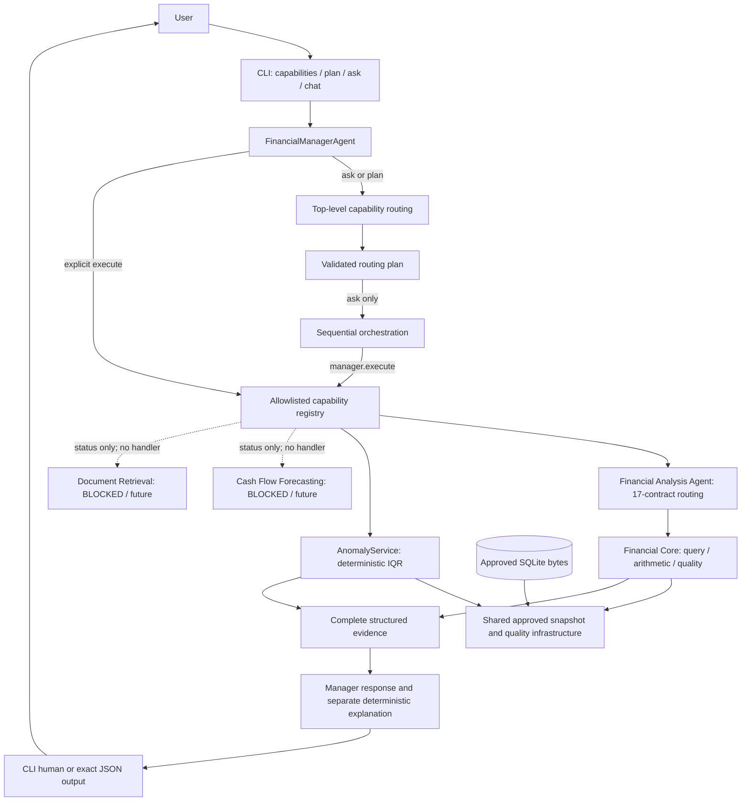

# Financial Manager AI — Technical Guide

This is the primary learning guide to the implemented local V1. It connects the
specialized documents to their source code; it does not replace query contracts
or historical validation reports. Current regression verification is recorded in
[Step 22 validation](step22_validation.md). Earlier step reports describe their
own checkpoints, not today's total test count.

## 1. Project purpose

V1 answers supported descriptive questions about two supplied financial datasets
and screens selected measures for statistical investigation candidates. Users run
one local CLI command at a time. The software preserves source meaning, exact
values, uncertainty and lineage instead of presenting every number as a verified
business fact.

One Financial Manager composes deterministic data/financial services and
interpretation/orchestration modules. Despite the project and class names,
**the default V1 uses no LLM**: interpretation is bounded English grammar and
explanation is templated. The provider seam permits future approved interpretation
adapters; it does not give a model authority over calculations or evidence.
This is not a group of autonomous LLM agents, an accounting ledger application,
a payment system or a company financial-statement platform.

## 2. High-level architecture



`plan` returns the preview without executing the arrows below it. Explicit Python
`execute` skips automatic capability selection. Blocked plans return metadata and
reasons before any service runs. The diagram's shared infrastructure is not a
generic financial fact table: analysis and screening query separate source domains.
AnomalyService reuses snapshot/quality helpers directly; it does not call the
analysis agent or reconstruct screening from an LLM explanation.

## 3. Project structure

| Location | Responsibility and reading entry point |
|---|---|
| `data/raw/` | Original supplied CSV bytes; no operational mutation |
| `data/processed/<run_id>/` | Versioned cleaning outputs, manifest, validation and review flags; only one run is approved for queries |
| `data/database/` | Published SQLite artifact and its load-validation report |
| `notebooks/01`–`05` | Inventory, two EDAs, cleaning plan and approved cleaning execution; historical evidence, not the request runtime |
| [`src/database/`](../src/database/) | Schema, approval manifest, loader, atomic builder and validation; start with `approved_run.json` and `initialize.py` |
| [`src/financial/`](../src/financial/) | Contracts, controlled filters, snapshot access, exact arithmetic, scoped quality, currency and offline FX eligibility; start with `core.py` |
| [`src/agents/`](../src/agents/) | Financial-analysis intent grounding, fixed tool registry, provider seam and evidence explanation; start with `financial_analysis.py` |
| [`src/anomaly/`](../src/anomaly/) | Independently callable screening service and IQR baseline; start with `service.py` and `baseline.py` |
| [`src/manager/`](../src/manager/) | Application facade, four-capability registry, top-level routing, orchestration and message-boundary checks |
| [`src/cli/`](../src/cli/) | Argument parsing, module entry point and presentation only |
| `tests/` | Unit, integration and real-subprocess acceptance validation |
| `docs/`, `CONTEXT.md` | Detailed contracts/designs and historical validation; glossary contains domain vocabulary, not runtime configuration |

There is no forecasting/RAG implementation directory, web application, server,
installed console-script package or dependency manifest. Runtime modules use the
standard library and project code. Notebook reproduction is a separate data-work
environment; its recorded Pandas/Python versions are not CLI dependencies.

## 4. Data pipeline

The actual lifecycle was raw CSV → inventory → EDA → cleaning plan → approved
cleaning → standardized CSV and quality artifacts → semantic model → SQLite →
Financial Core. Read [notebook 01](../notebooks/01_dataset_inventory.ipynb),
[02](../notebooks/02_eda_receiver_general.ipynb),
[03](../notebooks/03_eda_company_financials.ipynb),
[04](../notebooks/04_cleaning_plan.ipynb) and
[05](../notebooks/05_data_cleaning.ipynb) as evidence of those decisions.

The operational run is `20260928T190320706702Z_0a18cf5b`, pinned by
[`approved_run.json`](../src/database/approved_run.json). An older processed run
also exists; the loader does not select “latest” or merge runs. A processed value
retains its raw companion and parsing/status information. Manifest rules and
header mappings explain each representation; review flags record unresolved
conditions rather than silently repairing them.

Raw data remains immutable so parsing choices can be audited against original
tokens. Raw/processed SHA-256 hashes, run IDs, source-row positions, processed-row
positions and record IDs connect answers back to a source representation. A
technical record ID is not a proven unique payment, sale or business event.
The database additionally preserves original manifest/report text and flags.
Hash and round-trip checks establish faithful preservation, not authoritative
provenance, economic comparability or correctness of an unknown business meaning.

## 5. Current datasets

### Receiver General

The extract has **9,282 accounting records**, with effective dates from
**2023-04-03 to 2024-01-03**. It supports source-record counts, amount statistics,
accounting direction/voucher/department/dimension groups, effective-date chronology
and descriptive extremes. Records may include voucher/detail and summary/control
representations; their relationship and possible overlap remain unresolved.
Summing supplied rows is not a certified sum of distinct economic transactions.

DR/CR are source accounting direction codes. They do not establish expense versus
revenue, or cash outflow versus inflow. Fiscal Year/Fiscal Month are independent
accounting labels; chronology uses Accounting Effective Date, without mapping a
fiscal month to a calendar month.

Department and voucher type each lack 26 values. General ledger lacks 9,091,
subledger 2,186, financial coding block 9,000, and control type 178. Queries expose
coverage; sparse fields are not reconstructed into invented categories or hierarchies.
Denomination is UNKNOWN, including for Canadian-government-labelled source material.

### Company Financials

The extract has **700 sales records**, with **16 monthly labels from September
2013 through December 2014**. Segment, country, product and discount band are
sales categories. There is no verified company identifier, balance sheet, cash
account or company performance panel. `Sales` is not renamed verified company revenue.

Formatting was parsed under the approved cleaning contract, preserving raw tokens
and exact decimal text. **53 Discounts and 5 Profit placeholders remain unresolved**;
they are not zero or recomputed from accounting identities. The source contains
58 negative Profit values, retained under its approved sign convention. Units Sold
is quantity despite dollar-like source formatting; fractional quantity semantics
remain a limitation. Monetary denomination is UNKNOWN: neither `$` nor Country
determines currency. Dates are monthly labels, not proven transaction/receipt dates.

Counts, exact supported-measure summaries, category/period groups, profit signs,
discount coverage and quantity summaries are supported. Uneven category histories,
uncertain grain and incomplete acquisition provenance limit economic interpretation.
The [data model](data_model.md) defines these domain boundaries in detail.

## 6. Database layer

SQLite is the approved initial local persistence: it needs no service, supports
relational integrity and reproducible offline analysis, and fits the current
single-user V1. PostgreSQL/SaaS appeared as future directions, not implemented work.

Schema version 1 has eight tables: `schema_version`, `dataset_source`,
`processing_run`, `run_dataset`, `source_record`, `data_quality_flag`,
`receiver_general_accounting_record`, and `company_financial_sales_record`.
Shared tables provide lineage/quality; the two financial domains retain their
own fields. A false generic transaction table or accounting-to-sales join would
imply a common grain, currency or recognition basis that the evidence does not support.

The loader reads only the approved standardized bundle and validates hashes,
row counts, field/status round trips, source links and exact values. The builder
uses a transaction and temporary database, validates it before/after publication,
and refuses to replace an existing destination. Reconstructing representations is
supported; it is not an automatic operational refresh. A rebuilt database can
have different bytes/ingestion metadata and needs separate snapshot approval.

Analytical calls read the pinned database bytes, verify schema/source artifacts,
deserialize into an in-memory SQLite connection and enable `query_only`. Queries
use controlled field/table selections and bound parameters. The manager and CLI
never receive a connection. Rebuild writes belong to the administrative database
module, not the user analytical path; regression tests rebuild only temporary files.

Financial values are canonical decimal **TEXT**, with raw/status companions.
This preserves precision/scale without SQLite REAL coercion. Ordinary SQL SUM/AVG
or CAST on financial text is not authoritative. Validation has an exact
`DECIMAL_SUM`; runtime financial/statistical calculations use Python Decimal.
See [schema and reconstruction](database_schema.md) and
[`snapshot.py`](../src/financial/snapshot.py) for the two distinct responsibilities.

## 7. Financial Core

[`FinancialCore.query`](../src/financial/core.py) validates a controlled request,
selects records from the approved snapshot, calculates supported measures, accounts
for coverage/exclusions and attaches scoped quality/currency disclosures. Named
tool wrappers fix the contract identity. The
[version-1.0 contracts](query_contracts.md) are the authority for parameters and semantics.

| Receiver General | Company Financials |
|---|---|
| RG-01 Record Count | CF-01 Record Count |
| RG-02 Amount Summary | CF-02 Sales Summary |
| RG-03 Amount by Debit/Credit | CF-03 Sales by Period |
| RG-04 Amount by Voucher Type | CF-04 Sales by Country |
| RG-05 Amount by Department | CF-05 Sales by Segment |
| RG-06 Amount by Accounting Period | CF-06 Sales by Product |
| RG-07 Accounting Dimension Summary | CF-07 Profit Summary |
| RG-08 Extreme-Value Retrieval | CF-08 Discount Analysis |
| — | CF-09 Units Sold Summary |

Exact sums use precision 60 and trap rounding/inexactness; overflow blocks the
whole result rather than returning a rounded subtotal. Numeric comparisons preserve
source tokens for minima/maxima and rankings. Medians preserve exact additional
fractional digits when needed. Means and coverage percentages round an exact
integer rational once to six decimal places, half-even. No automatic two-decimal
quantization or binary-float financial authority is used. Financial values serialize
as strings. Sale Price totals, monetary shares/ratios and FX conversion are not
silently added to this contract set.

Core statuses are SUCCESS, PARTIAL, NO_DATA, INVALID_REQUEST, UNSUPPORTED and
DATA_QUALITY_BLOCKER. The envelope retains result, dataset/query identity, records,
quality, currency, errors, filter diagnostics and metadata. Record accounting
separates population, filtered-out, unavailable-filter, candidate, used and excluded
records; individual measures have their own coverage. A missing measure remains
null. An explicit unavailable grouping bucket is presentation metadata, not a
fabricated source category.

Quality is query-aware: unrelated missing Department does not make an amount
summary partial. Relevant missing dimensions/measures/filters can make coverage
partial; explicit null selection and NO_DATA follow the contract rules. Unknown
currency or source uncertainty can accompany SUCCESS. Current source flags include
`source_missing`, `unresolved_placeholder`, `currency_unknown`,
`fiscal_alignment_unresolved` and `source_semantics_unresolved` (including provenance).
Flags remain available in summary/full detail. RG calendar-period queries retain
the approved fiscal-alignment disclosure without equating the calendars.

Monetary envelopes carry UNKNOWN, null code/source and `conversion_applied=false`;
counts/Units Sold have `currency=null`. Currency types also represent evidenced
INFERRED and CONFIRMED states, but current data uses neither. MIXED is a future
partitioned-envelope concept, not a scalar monetary total.

The offline FX module stores exact dated quotes and checks eligibility. Its local
provider is empty by default. UNKNOWN/INFERRED originals are refused before lookup;
even RATE_AVAILABLE produces no converted amount. Pair/date alone cross the FX
provider seam, never transaction amounts. No network provider or conversion exists.
See [Financial Core](financial_core.md) for arithmetic and quality details.

## 8. Financial Analysis Agent

The Step 13 path is question → grounded contract intent → allowlist/argument
validation → Financial Core → complete evidence → deterministic explanation.
[`financial_analysis.py`](../src/agents/financial_analysis.py) owns this composition;
[`routing.py`](../src/agents/routing.py) interprets supported query language.

`IntentProvider` accepts only question, optional dataset context and static tool
metadata. `LocalQuestionProvider` reuses the bounded grammar, without an LLM.
The agent grounds the question before provider interpretation, then requires the
provider's normalized proposal to agree. This repeated grounding is intentional
authority checking, not a second financial algorithm. Structured supplemental
parameters merge only under conflict/contract validation; no condition is discarded.

It supports documented dataset names, measures/groups, explicit dates and controlled
filter forms. Relative dates, incomplete periods and unconsumed wording request
clarification. It cannot generate SQL: the registry allows only 17 controlled
Core requests. Providers never receive result rows, a database connection or the
separate supplemental parameter object. PRIVATE/EXTERNAL or unlabelled providers
fail closed; LOCAL is trusted configuration, not a process sandbox.

The agent response separates `tool_request`, complete `tool_result`, evidence
digest, status, errors/clarification and explanation. The digest is not a digital
signature. ANSWERED can wrap PARTIAL or NO_DATA; consumers must inspect evidence
status. See [agent contract and grammar](financial_analysis_agent.md).

## 9. Anomaly detection

[`AnomalyService.analyze`](../src/anomaly/service.py) is a deterministic data service,
not an LLM agent. It can be tested without language interpretation; statistical
evidence stays reproducible under the same snapshot/request.

The baseline uses linear `(n-1)*p` quartiles and Tukey fences with multiplier 1.5.
RG screens the upper tail of accounting amount globally and within debit/credit ×
voucher-type peers. CF Sales and Profit use both tails globally and within segment ×
sale-price peers. Numeric-equivalent price tokens share a peer; price is not summed.
Each selected cohort includes the assessed records themselves. This is descriptive
in-sample screening, not predictive model evaluation.

At least **30 available numeric values** and a positive IQR are required per
reference. Missing measures/groups, undersized peers and zero IQR yield
NOT_ASSESSED. Global and peer assessments are independent; an unavailable peer
does not inherit the global label. A value strictly above the upper fence (or below
the lower fence for CF) yields
CANDIDATE; eligible values not selected yield NOT_SELECTED, never “certified normal.”

Every record retains source lineage, original value/status, assessment/reference
links and quality-warning references; reference objects expose fences and peer
sizes. Unknown currency and source comparability remain disclosed. These are
**investigation candidates, not fraud/error findings or probabilities**. No labels,
accuracy/recall claims, ML dependency or new financial semantics are introduced.
Sparse alternative peer groups and other measures remain deferred as explained
in [screening design/readiness](anomaly_detection.md).

## 10. Forecasting

Cash Flow Forecasting is **BLOCKED**. Neither source establishes actual settled
cash inflows/outflows, verified balances or a cash-account scope. Accounting
effective dates are not cash-value dates; sales are not receipts. RG has less
than a year of coverage and CF only 16 monthly labels, with uneven subgroup
histories. Missing-period meaning, comparable population and denomination are unresolved.

Future work requires authoritative cash events/period aggregates, confirmed
currency, account/entity perimeter, date/calendar/completeness rules, settled
cash_in/cash_out semantics, transfer/reversal handling and lineage. Balance
forecasting additionally needs reconciled opening/closing balances. The project
gate calls for at least two complete annual cycles plus a chronological evaluation
reserve appropriate to the horizon; this is a readiness policy, not a guarantee
that forecasting will work.

The documented progression is naive baseline → moving average/exponential
smoothing → statistical model → ML only if justified, using chronological
evaluation and explicit assumptions/uncertainty. No target schema, series, training
split or model has been fabricated. BLOCKED is an intentional correctness decision.
See [required future data and design](forecasting_readiness.md).

## 11. Document RAG

Production corpus readiness is **BLOCKED**; implementation/architecture readiness
is **DEFERRED** despite a documented design. There is no ingestion, parser,
embedding provider, vector index, retrieval implementation or citation generator.
CSV/SQLite facts are queried by tools; project engineering docs are not a production
financial-document corpus.

The proposed flow is approved documents → ingestion/extraction → traceable chunks
→ optional appropriate embedding/index strategy → retrieval evidence → explanation.
Future evidence must retain document/source identity, byte hash, page/section,
chunk ID, method/score and ingestion version. A citation must support its claim;
retrieval scores are not truth probabilities.

The design favors local processing; private or external embedding/model transports
would need separate approval and minimum-data policies. No such adapter exists,
and the intent-provider protocol is not reused as a document embedding interface.
Read [RAG design and corpus gate](rag_architecture.md) as future design, not current code.

## 12. Main Financial Manager Agent

[`FinancialManagerAgent`](../src/manager/agent.py) is the stable application facade.
`list_capabilities()` and `get_capability(...)` inspect the registry;
`execute(capability=..., request=...)` delegates an explicit choice without rerouting it.

| Capability | Current availability | Owner / reason |
|---|---|---|
| FINANCIAL_ANALYSIS | AVAILABLE | Existing Step 13 agent and 17 contracts |
| ANOMALY_DETECTION | AVAILABLE | Existing Step 14 service |
| CASH_FLOW_FORECASTING | BLOCKED | No verified cash target/history/currency |
| DOCUMENT_RETRIEVAL | BLOCKED | No approved production corpus or retrieval implementation |

DEFERRED also exists in the availability vocabulary, but no current registry entry
uses it. The manager registers exactly these four capabilities, not every item
in the historical six-capability roadmap. Blocked entries have no execution handler.

The unified response preserves complete `delegated_result` plus separate
`execution_status`, `delegated_status`, capability availability, summary, warnings,
limitations, errors and clarification. The manager does no arithmetic and opens
no database; adapters only bridge the existing agent `ask` and service `analyze`
interfaces. See [facade contract](main_financial_manager_agent.md).

## 13. Routing and orchestration

Two different decisions remain separate:

- **Step 18:** question → one of four capabilities, using registry status.
- **Step 13:** an analysis question → one of 17 approved RG/CF query contracts.

The top-level router does not choose CF-04 or infer analysis filters. Its small
screening adapter recognizes complete supported unfiltered targets and reuses the
anomaly request validator. `plan(question)` is a data-only preview; `ask(question)`
constructs a fresh validated plan and executes exclusively through `manager.execute`.
Explanation text and caller-modified previews are not execution plans.

| Routing status | Meaning |
|---|---|
| ROUTED | One available capability selected |
| MULTI_CAPABILITY | Supported independent analysis + screening clauses |
| BLOCKED | Recognized unavailable capability; no execution |
| CLARIFICATION_REQUIRED | Ambiguous purpose/scope, dependency or unconsumed wording |
| UNSUPPORTED | No legitimate capability/interpretation for the request |
| INVALID_REQUEST | Malformed, blank, overlong or invalidly quoted request |

Multi-capability execution has a stable analysis-then-screening order. Each step
gets its own authoritative inputs and returns its own evidence. Results are never
summed together and an explanation is never fed to the other service. Preflight
ambiguity prevents execution; after execution starts, a noncontinuable step stops
later steps. SUCCESS, PARTIAL and NO_DATA are continuable. There is no hidden retry,
fallback or dependent multi-step reasoning. See [grammar and stop rules](orchestration.md).

Do not confuse status layers: a BLOCKED routing plan produces a manager
CAPABILITY_UNAVAILABLE outcome and NOT_PERFORMED execution state. AVAILABLE means
the service exists, not that every query succeeds. PARTIAL/NO_DATA remain evidence
outcomes, and NOT_ASSESSED belongs to individual screening assessments.

## 14. Security and privacy boundaries

Step 19 protects the current local application boundaries, not a deployed service:

- Static capability/tool allowlists prevent user strings becoming imports,
  functions, SQL or shell programs. There is no dynamic registration endpoint.
- Message checks admit finite data-only values, reject executable/custom objects,
  cycles and excessive nesting, and prevent live database handles in responses.
- Specialized modules own snapshot access and bound filters. User language is
  interpreted as approved parameters or refused, never executed as SQL.
- Interpretation providers receive minimal question/static context, not evidence.
  All nonlocal/unlabelled interpretation providers are refused before invocation.
  The FX seam has no network implementation and only pair/date inputs.
- Complete evidence is copied without changing numbers, currency, warnings,
  candidate statuses or lineage. Explanations cannot override evidence. Returned
  dictionaries remain caller-owned, not tamper-proof audit records.
- Snapshot/provider failures use controlled application messages at their source.
  Unexpected development exceptions may propagate in Python; the CLI emits fixed
  invocation/syntax/cancellation diagnostics rather than tracebacks/private text.

No telemetry, network transport, credentials or external fallback is added.
Trusted local Python configuration can still execute code; a LOCAL label is not
proof of network isolation. Shell history, saved output and financial evidence
remain sensitive. Authentication, RBAC, encryption-at-rest management, process
sandboxing, deployment egress controls and production secret management are not
implemented. See [boundary policy](security_privacy_boundaries.md) for precise limits.

## 15. CLI

The standard-library CLI parses command syntax and calls the manager unchanged:
`capabilities` → listing, `plan` → preview, `ask` → orchestration. The additive
`chat` command creates one `FinancialManagerSession`; plain text calls
`new_request`, and explicit slash commands call the corresponding session
operations. It has no SQL, financial logic or second router. Quote one-shot
questions as one shell argument.

Default human output contains labeled statuses/explanations and first-10 previews
of large evidence collections with explicit returned/total/omitted counts.
`--full` provides expanded human evidence. `--json` returns the complete application
object; exact Decimal values, if present, become strings without float conversion.
Preview selection and warning deduplication are display-only. Terminal controls
are escaped for human display without mutating source objects.

Exit codes: **0** for help or a delivered structured outcome (including blocked,
clarification, unsupported and no-data), **2** for invalid command syntax, **1** for
cancellation or unexpected invocation/output failure. Automation must inspect JSON
statuses; exit 0 does not imply financial execution. Error diagnostics use stderr,
including in JSON mode. Chat exits cleanly on `/exit`, EOF or Ctrl+C and remains
concise-only; it does not add pagination. Its Phase 10 session is process-memory
only and is not a persistent CLI session store. See
[the chat contract](conversational_cli_contract.md), [CLI details](cli_workflow.md)
and runnable commands in section 21.

## 16. End-to-end request examples

### A. “What were total sales by country?”

CLI `ask` calls the manager. Step 18 selects FINANCIAL_ANALYSIS and normalizes only
the introductory wording; Step 13 selects CF-04 with `measures=["sales"]`. The
Core validates the request, reads the approved sales domain, groups and sums
exact values, and attaches record/quality/currency metadata. The analysis agent
copies that evidence and renders its explanation; manager/CLI preserve it.
The verified outcome is SUCCESS with UNKNOWN currency, not verified company revenue.

### B. “Find unusual Profit values.”

Step 18 selects ANOMALY_DETECTION and constructs the approved CF Profit request;
`values` is a recognized surface-language suffix, not a discarded modifier. The
manager calls AnomalyService directly; Step 13 is not involved.
The service reads the snapshot, computes global/pricing-peer IQR evidence and
attaches quality references. The verified outcome is PARTIAL: five unresolved
Profit values stay unassessed. The explanation says candidates require investigation.

### C. “Forecast cash flow next month.”

The router recognizes CASH_FLOW_FORECASTING, finds BLOCKED in the registry and
returns its readiness reasons. Execution is NOT_PERFORMED and the application
outcome is CAPABILITY_UNAVAILABLE. No model runs and analysis is not substituted.

### D. “What does invoice 123 say?”

Document intent selects DOCUMENT_RETRIEVAL. The missing approved corpus yields
the BLOCKED plan and no execution. No engineering file, synthetic invoice or
invented citation is substituted as financial evidence.

### E. “Check my financial data.”

There is insufficient purpose to choose summary versus screening. Top-level
clarification requests the measure and purpose; no service executes. Separately,
“How many records are there?” selects analysis but Step 13 asks which dataset.
Submit a complete clarified question, such as “Receiver General record count”,
or use the interactive CLI's explicit `/answer` command for an approved closed
continuation. Plain text remains a new request and never becomes an answer
implicitly.

### F. Bounded session continuation

`FinancialManagerSession` exposes explicit `new_request`, `answer`, `follow_up`,
`cancel`, `reset` and `status` operations. It retains only one typed contextual
descriptor, expires after 30 minutes inactive or four hours absolute, and never
stores full chat history. Supported clarification reconstruction is limited to
top-level analysis/screening choice and canonical record-count dataset choice.
Supported evidence follow-up is limited to session-issued anomaly-candidate
handles and always performs fresh routing, registry validation and deterministic
service execution before returning structured detail. See the
[Phase 10 validation](conversational_ux_validation.md). Phase 11 exposes these
same operations through `python -m src.cli chat`; the CLI does not duplicate them.

## 17. Deterministic versus agent responsibilities

| Responsibility | Current owner and behavior |
|---|---|
| Stored representations and lineage | Database schema, loader and validation |
| Exact calculations, filters, coverage and currency | Financial Core and shared helpers |
| Global/peer references and assessments | Deterministic anomaly baseline/service |
| Capability availability and message policy | Static manager registry and security checks |
| Supported question → capability | Deterministic top-level router |
| Analysis question → approved contract | Deterministic Financial Analysis grounding/provider |
| Execution order and result wrapping | Deterministic manager/orchestration |
| Explanation and presentation | Templates and CLI, with no financial recalculation |
| Bounded turn context | Local Python session; contextual metadata only, followed by fresh routing/execution |

“Agent responsibility” describes interpretation and coordination, not a claim
that an LLM currently drives it. All default behavior is local and deterministic
for the same validated state/request. A future model may propose an intent only
within an explicitly approved boundary. This separation makes financial evidence
auditable and independently testable when language interpretation changes.

## 18. Testing strategy

The verified regression baseline is **369 passed, 0 failed, 0 errors and 0
skipped**. The current full run and Phase 11 review evidence are recorded in
[Step 35 validation](step35_validation.md); the Phase 10 review is in
[Step 33 validation](step33_validation.md), and the original V1 review is in
[Step 22 validation](step22_validation.md).

| Test layer | What it protects |
|---|---|
| Database (17) | Rebuild/round-trip integrity, exact storage, failures and source preservation |
| Core (37), quality (19), currency/FX (22) | Contract validation, arithmetic, missingness, scope-aware warnings and offline rate eligibility |
| Analysis agent (36) | 17-contract routing, provider grounding, unsupported meanings and intact evidence |
| Anomaly (32) | IQR boundaries, peer eligibility, fixtures and actual EDA-aligned populations |
| Manager (31), orchestration (35) | Explicit/automatic delegation, statuses, independent plans/results and blocked capabilities |
| Security/privacy (18) | Allowlisting, data-only messages, provider/error and evidence boundaries |
| CLI (25) | Presentation, safe errors, exact JSON and delegation |
| Conversational CLI (13) | Explicit operation mapping, lifecycle, references, expiry and safe interactive exits |
| Acceptance (19) | Real CLI subprocesses through approved data/services to final output |
| Bounded conversation (40) | Clarification/session lifecycle, evidence references, expiry, isolation and fail-closed state |

Counts are unittest methods, not expanded subcases. Acceptance guards network and
process boundaries, forbids database connections where no query should occur,
checks canaries/controlled errors and hashes protected assets. It compares complete
results to public Core/service evidence rather than rebuilding financial algorithms.
Unavailable capabilities are explicitly tested, not skipped. Regression testing
keeps earlier promises intact while later layers are added; a passing integration
test alone does not prove source semantics or statistical detection accuracy.

## 19. Important architectural decisions

| Decision | Rationale / consequence |
|---|---|
| Immutable source/approved artifacts | Reproducible parsing and lineage; changed inputs fail closed rather than quietly changing answers |
| Decimal TEXT plus exact arithmetic | Preserve original precision; refuse unrepresentable exact results instead of hiding rounding |
| UNKNOWN denomination | Missing currency evidence is visible; geography/symbols cannot authorize conversion |
| Separate source-domain facts, shared lineage/quality | Common infrastructure does not imply comparable business events or money |
| Core/services own calculations | Changing interpretation/explanation cannot redefine an amount or threshold |
| Allowlisted queries and capabilities | User text selects validated parameters, never an executable program |
| Screening separated from accusations | Statistical deviation is evidence for investigation, not a fraud label |
| Explicit blockers | Missing cash data/documents cannot be solved by fabricating forecasts or retrieval |
| Local deterministic default | Existing workflows need no provider credentials, network or private-data transmission |
| Evidence separate from explanation | Full results remain inspectable even when text is summarized or changed |
| Two routing levels | Capability selection can evolve without duplicating 17 domain contracts |

These decisions are supported by code, contracts and the
[single-manager ADR](adr/0001-financial-manager-com-ferramentas-especializadas.md).
This guide records their rationale; it does not ratify new architecture proposals.

## 20. Current limitations

Currency, acquisition provenance, economic comparability and source grain remain
unresolved. RG has sparse dimensions, uncertain summary/detail overlap and fiscal
alignment. CF lacks company identity and verified statement/cash semantics; its
placeholders, quantity meaning and uneven category histories remain visible.
Limited history and unsupported targets block forecasting; absent documents block RAG.

Language is bounded English, not arbitrary financial conversation. Conversation
state supports only two clarification types and explicit anomaly-candidate
handles through the Python API or its thin interactive CLI adapter; it adds no
implicit pronoun resolution, general memory or persistent chat. Screening uses
fixed measures/peers, and automatic screening accepts only supported unfiltered
targets; advanced approved parameters use Python interfaces. Full human and JSON
output can be large; concise mode is a fixed preview rather than pagination.
There is no authentication/RBAC, web/API, deployment, external model/FX, persistent
or general-purpose conversational memory, or general production security guarantee. Tests cover the supplied local
snapshot/runtime, not every platform, concurrent workload or financial interpretation.

The repository has no dependency lock/package installer, and required local data
and environment files may not be tracked in Git. A fresh clone alone is not a
documented complete installation. Preserve the approved asset bundle and recorded
environment; do not rerun cleaning or replace the snapshot just to start the CLI.

## 21. How to run the project

Run from the repository root using the supplied `.venv`, approved raw/processed
artifacts, notebooks and SQLite snapshot. `sqlite3.Connection.deserialize` must
be available; this checkout's existing Python runtime supports it. No service,
API key, model download or dependency installation is needed for the runtime path.

```sh
# Activate the existing environment (bash).
source .venv/bin/activate

# Inspect / preview / execute.
python -B -m src.cli capabilities
python -B -m src.cli plan "Find outliers in Profit"
python -B -m src.cli ask "What were total sales by country?"
python -B -m src.cli ask "What were total sales by country?" --json
python -B -m src.cli ask "Forecast cash flow next month"
python -B -m src.cli chat

# Full regression, including acceptance.
python -B -m unittest discover -s tests -v

# Acceptance only.
python -B -m unittest discover -s tests -p test_acceptance.py -v
```

Activation is optional: replace `python` with `.venv/bin/python`. `-B` avoids
writing bytecode caches; it does not change analytical behavior. The commands were
checked against this checkout. Database reconstruction is a separate administrative
operation documented in [database schema](database_schema.md#initialization-and-verification-interface);
do not run the builder over the existing production destination. For a new machine,
runtime/environment and protected-artifact provisioning still need a separately
reviewed reproducible setup procedure.

## 22. How to study the project

1. **This guide and [glossary](../CONTEXT.md):** learn scope, layers and distinctions
   among accounting entries, sales, cash movements and uncertain denomination.
2. **[Data model](data_model.md) → [schema](database_schema.md):** understand why
   source domains stay separate and how a result reaches original evidence.
3. **[Query contracts](query_contracts.md) → [Core](financial_core.md):** learn
   allowed questions, exact arithmetic, statuses, missingness and quality rules.
4. **[Analysis agent](financial_analysis_agent.md):** follow one question into a
   controlled contract; see why provider proposals are checked before execution.
5. **[Screening](anomaly_detection.md):** study peer eligibility, abstention and
   descriptive evidence independently of question interpretation.
6. **[Manager](main_financial_manager_agent.md) → [orchestration](orchestration.md):**
   distinguish explicit delegation, capability routing and independent execution plans.
7. **[Security](security_privacy_boundaries.md) → [CLI](cli_workflow.md):** understand
   trust boundaries, local data exposure, presentation and status/exit-code differences.
8. **[Acceptance](v1_acceptance.md) and [validation](step21_validation.md):** see which
   real user workflows were exercised and what PASS does—and does not—establish.
9. **Source and matching tests:** trace `src/cli/main.py` → `src/manager/agent.py`
   → `orchestration.py`/`registry.py` → the selected service → `snapshot.py`.
   Read `test_acceptance.py`, then the owning module's tests for edge conditions.
10. **[Forecast](forecasting_readiness.md), [RAG](rag_architecture.md), historical
    [planning](planning/v1-direction.md):** distinguish data gates, future design
    and initial assumptions from operational capabilities. Read notebooks last
    when investigating why a particular source or cleaning limitation exists.

## 23. Evolution roadmap

**Implemented V1:** validated data representation/SQLite, 17 descriptive contracts,
quality/currency metadata and offline FX eligibility, bounded analysis interpretation,
IQR screening, explicit/automatic manager delegation, message/privacy boundaries,
CLI and end-to-end acceptance. No live LLM is needed.

**Blocked pending evidence/data:** actual-cash forecasting and production financial
document retrieval. Obtain authoritative representative sources and rerun readiness
gates before approving implementation; neither a design nor a fixture is production evidence.

**Potential future engineering, not authorized here:** reproducible environment and
asset provisioning; measured grammar/usability improvements; performance work when
actual workloads justify it; separately reviewed local/private model adapters;
and, only with a deployment scope, authentication, RBAC, egress and operational
controls. PostgreSQL/web/API, accounts payable and budget variance are historical
or potential directions, not current registered capabilities. The next decision
should choose a concrete use case and evidence requirements, rather than expand
the implementation merely to complete the original roadmap.
